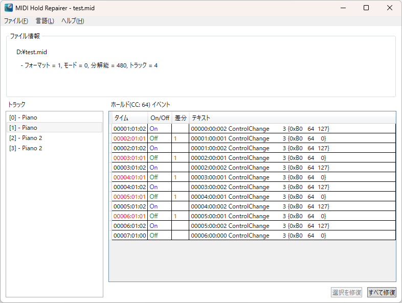

[English](README.md) | 日本語

# MIDI Hold Repairer

このアプリケーションは、MIDIファイル内のペダルイベント(コントロールチェンジ64番)のうち、狭すぎるOn/Offイベントのタイミングを修復します。

## 実行環境

* OS: Windows 10/11 **64ビット (x64)**
* アーキテクチャ: **x64 のみ**（32ビット / x86 は非対応）
* [.NET デスクトップ ランタイム 6.0 (x64)](https://dotnet.microsoft.com/download/dotnet/6.0)

## 言語

UI の言語は、既定ではシステムの言語（日本語または英語）に従います。  
**言語** メニューから手動で切り替えできます。

* **システム** — OS の UI 言語に従う（既定）
* **English**
* **日本語**

選択内容は保存され、次回起動時に復元されます。

## 外観

### メインウインドウ

* 上部枠
以下のMIDIファイル情報を表示します。
  * フォーマット: SMF(Standard MIDI File)フォーマット(=0,1,2)
  * モード: タイムベース(=0:TPQN, 24:SMPTE24, 25:SMPTE25, 29:SMPTE29, 30:SMPTE30)
    > **_注:_**
    > このアプリケーションはTPQNモードのみをサポートします。
  * 分解能: ４分音符あたりのティック数
  * トラック: ファイル内のトラック数
* 左枠
ファイル内のトラックリスト
* 右枠
選択されたトラック内のペダルイベント(Hold1 = コントロールチェンジ64番)のリスト
  * タイム: `小節数:拍数:ティック数`
    > **_タイミングが短すぎる場合、赤字になります。_**
  * On/Off: ペダルの On/Off を表示
  * 差分: 次のペダルオフイベントまでのティック数
    > **_ティック数が少なすぎる場合、赤字になります。_**
  * 選択を修復 ボタン
    選択されたイベントのタイミングを修復します。
    > **_修復可能なイベントが選択されていない場合、このボタンは押せません。_**
  * すべて修復 ボタン
    リスト内のすべてのイベントのタイミングを修復します。
    > **_リスト内に修復可能なイベントがない場合、このボタンは押せません。_**

## サードパーティーライブラリについて
このアプリケーションでは、「[MIDIDataライブラリ8.0](https://openmidiproject.opal.ne.jp/MIDIDataLibrary.html)」を使用します。
