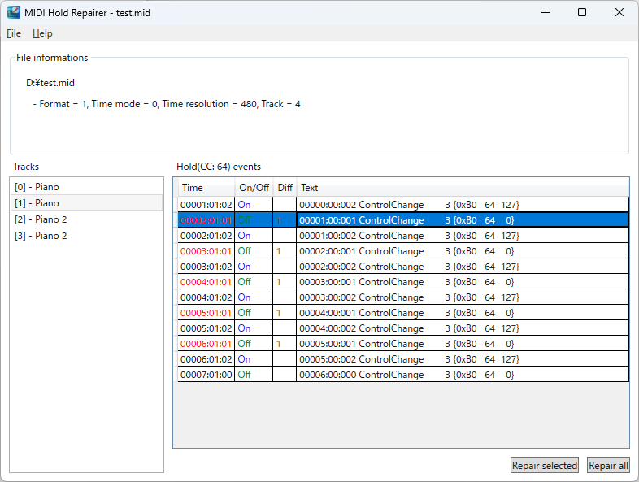

English | [日本語](README-ja.md)

# MIDI Hold Repairer

This application repairs too short a tick time between a pedal (Control Chante #64) off and next on event in a MIDI file.

## Appearance

### Main window

* Top pane
MIDI file information below.
  * Format: Standard MIDI File format(=0,1,2)
  * Time mode: Time base(=0:TPQN, 24:SMPTE24, 25:SMPTE25, 29:SMPTE29, 30:SMPTE30)
    > **_NOTE:_**
    > This application only supports TPQN mode.
  * Time resolution: Ticks per quarter note
  * Track: Number of tracks in file
* Left pane
Track list within file
* Right pane
List of padal events(Hold1 = Control Change #64) in the selected track
  * Time: `Measures:Beats:Ticks`
    > **_If the timing is too short, it will be in the red._**
  * On/Off: Indicates pedal on/off
  * Diff: Number of ticks until next pedal off
    > **_If the number is too short, it will be in the red._**
  * Repair selected button
    Repairs the timing of the selected event.
    > **_This button cannot be pressed if no events are selected that can be repaired._**
  * Repair all button
    Repairs the timing of all events in the list.
    > **_This button cannot be pressed if there are no events in the list that can be repaired._**

## About third party library
This application uses [[MIDIData library 8.0](https://openmidiproject.opal.ne.jp/MIDIDataLibrary.html)].